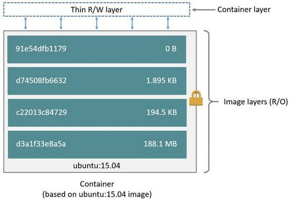

Каждому образу Docker соответствует файл, который называется Dockerfile. Его имя — без расширения.
Dockerfile находится в текущей рабочей директории. 
Если этот файл находится в каком-то другом месте, его расположение можно указать с использованием флага -f

 

Контейнеры состоят из слоёв. Каждый слой, кроме последнего, находящегося поверх всех остальных, предназначен
только для чтения. Dockerfile сообщает системе Docker о том, какие слои и в каком порядке надо добавить в образ.

Каждый слой, на самом деле, это всего лишь файл, который описывает изменение состояния образа в сравнении с тем состоянием, в котором он пребывал после добавления предыдущего слоя.

Базовый образ — это то, что является исходным слоем (или слоями) создаваемого образа. Базовый образ ещё называют
родительским образом. 
Базовый образ — это то, с чего начинается образ Docker

<table>

   <tr>
     <td style="max-width: 800px;" colspan='2'><h1>Dockerfile</h1></td></tr>
   <tr>
     <td style="max-width: 800px;" colspan='2'>
       
В файлах Dockerfile содержатся инструкции по созданию образа. С них, набранных заглавными буквами, начинаются строки этого файла. После инструкций идут их аргументы. Инструкции, при сборке образа, обрабатываются сверху вниз. Вот как это выглядит: 

     <pre><code>FROM ubuntu:18.04
COPY . /app</code></pre> 
      
Слои в итоговом образе создают только инструкции <code>FROM</code>, <code>RUN</code>, <code>COPY</code>, и <code>ADD</code>. Другие инструкции что-то настраивают, описывают метаданные, или сообщают Docker о том, что во время выполнения контейнера нужно что-то сделать, например — открыть какой-то порт или выполнить какую-то команду.

    </td>
   </tr>
   <tr>
     <td style="max-width: 800px;" colspan='2'><h2>Список инструкций Dockerfile с краткими комментариями</h2></td>
   </tr>
   <tr>
     <td style="max-width: 800px;" colspan='2'>
       <ol>
        <li><code>FROM</code> — задаёт базовый (родительский) образ.</li>
        <li><code>LABEL</code> — описывает метаданные. Например — сведения о том, кто создал и поддерживает образ.</li>
        <li><code>ENV</code> — устанавливает постоянные переменные среды.</li>
        <li><code>RUN</code> — выполняет команду и создаёт слой образа. Используется для установки в контейнер пакетов.</li>
        <li><code>COPY</code> — копирует в контейнер файлы и папки.</li>
        <li><code>ADD</code> — копирует файлы и папки в контейнер, может распаковывать локальные .tar-файлы.</li>
        <li><code>CMD</code> — описывает команду с аргументами, которую нужно выполнить когда контейнер будет запущен. Аргументы могут быть переопределены при запуске контейнера. В файле может присутствовать лишь одна инструкция <code>CMD</code>.</li>
        <li><code>WORKDIR</code> — задаёт рабочую директорию для следующей инструкции.</li>
        <li><code>ARG</code> — задаёт переменные для передачи Docker во время сборки образа.</li>
        <li><code>ENTRYPOINT</code> — предоставляет команду с аргументами для вызова во время выполнения контейнера. Аргументы не переопределяются.</li>
        <li><code>EXPOSE</code> — указывает на необходимость открыть порт.</li>
        <li><code>VOLUME</code> — создаёт точку монтирования для работы с постоянным хранилищем.</li>
      </ol>
     </td>
   </tr>
   <tr>
     <td style="max-width: 800px;" colspan='2'><h3>Инструкции и примеры их использования</h3></td>
   </tr>

   <tr>
      <th>
         <code>FROM python:3.10</code>
      </th>
      <td>
          Говорим - 'Загружай python' 
          
Файл Dockerfile должен начинаться с инструкции <code>FROM</code>, или с инструкции <code>ARG</code>, за которой идёт инструкция <code>FROM</code>.

          
<a href="https://docs.docker.com/engine/reference/builder/#from">FROM</a> сообщает Docker о том, чтобы при сборке образа использовался бы базовый образ, который соответствует предоставленному имени и тегу. Базовый образ, кроме того, ещё называют <a href="https://docs.docker.com/develop/develop-images/baseimages/">родительским образом</a>.  
          В этом примере базовый образ хранится в репозитории <code>python:3.10</code>. 
          Каждый следующий слой представляет собой файл, описывающий отличия образа в сравнении с тем его состоянием, в котором он был после добавления в него предыдущего слоя

          
При создании контейнера слой, в который можно вносить изменения, добавляется поверх всех остальных слоёв. Данные, находящиеся в остальных слоях, можно только читать.

        
</td>
   </tr>

   <tr>
     <td style="max-width: 800px;" colspan='2'>
      <h3>Более сложный Dockerfile</h3>
    </td>
   </tr>
   <tr>
     <td style="max-width: 800px;" colspan='2'>
       
Dockerfile который собирает маленький образ. В нём имеются механизмы, определяющие команды, вызываемые во время выполнения контейнера.

     </td>
   </tr>
   <tr>
     <td style="max-width: 800px;" colspan='2'>
        <pre><code>FROM python:3.7.2-alpine3.8
LABEL maintainer="jeffmshale@gmail.com"
ENV ADMIN="jeff"
RUN apk update &amp;&amp; apk upgrade &amp;&amp; apk add bash
COPY . ./app
ADD https://raw.githubusercontent.com/discdiver/pachy-vid/master/sample_vids/vid1.mp4 /my_app_directory
RUN ["mkdir", "/a_directory"]
CMD ["python", "./my_script.py"]</code></pre> 
        <ol>
          <li>
            <code>FROM</code> <i>Базой этого образа является официальный образ Python с тегом 3.7.2-alpine3.8.</i> 
          </li>
          <li>
            <code>LABEL</code><i>позволяет добавлять в образ метаданные. В случае с рассматриваемым сейчас файлом, она включает в себя контактные сведения создателя образа.</i> 
            
Подробности о работе с метаданными в Dockerfile можно прочитать здесь. 

          </li>
          <li>
            <code>ENV</code> <i>позволяет задавать постоянные переменные среды, которые будут доступны в контейнере во время его выполнения. В предыдущем примере после создания контейнера можно пользоваться переменной <code>ADMIN</code></i> 
            
Так же подходит для задания констант. Если вы используете некое значение в Dockerfile несколько раз, скажем, при описании команд, выполняющихся в контейнере, и подозреваете, что, возможно, вам когда-нибудь придётся сменить его на другое, его имеет смысл записать в подобную константу.

           </li>
          <li>
            <code>RUN</code><i> позволяет создать слой во время сборки образа. После её выполнения в образ добавляется новый слой, его состояние фиксируется. </i> 
            
Часто используется для установки в образы дополнительных пакетов.

            
Если вы используете базовый образ какой-то другой ОС семейства Linux, тогда вам, например, при использовании Ubuntu, для установки пакетов может понадобиться команда вида <code>RUN</code> <code>apt-get</code>

            
Инструкция <code>RUN</code> и схожие с ней инструкции — такие, как <code>CMD</code> и <code>ENTRYPOINT</code>, могут быть использованы либо в exec-форме, либо в <code>shell-форме</code>. <code>Exec-форма</code> использует синтаксис, напоминающий описание <code>JSON-массива</code>. Например, это может выглядеть так: <code>RUN</code> <code>["my_executable", "my_first_param1", "my_second_param2"]</code> 
            В предыдущем примере мы использовали <code>shell-форму</code> инструкции <code>RUN</code> в таком виде: <code>RUN apk update && apk upgrade && apk add bash</code>.

            
<code>exec-форма</code> инструкции <code>RUN</code>, в виде <code>RUN ["mkdir", "/a_directory"]</code> 

             </li>
            <li><code>COPY</code><i>представлена в нашем файле так: <code>COPY . ./app</code>. Она сообщает Docker о том, что нужно взять файлы и папки из локального контекста сборки и добавить их в текущую рабочую директорию образа. Если целевая директория не существует, эта инструкция её создаст.</i> </li>
            <li><code>ADD</code><i>позволяет решать те же задачи, что и COPY, плюс с помощью этой инструкции можно добавлять в контейнер файлы, загруженные из удалённых источников, а также распаковывать локальные .tar-файлы</i> 
              
В этом примере инструкция <code>ADD</code> была использована для копирования файла, доступного по URL, в директорию контейнера <code>my_app_directory</code>. Надо отметить, однако, что <a href="https://docs.docker.com/develop/develop-images/dockerfile_best-practices/">документация Docker</a> не рекомендует использование подобных файлов, полученных по URL, так как удалить их нельзя, и так как они увеличивают размер образа. 
              Кроме того, документация предлагает везде, где это возможно, вместо инструкции <code>ADD</code> использовать инструкцию <code>COPY</code> 

              
Инструкция <code>ADD</code> содержит символ разрыва строки — <code>  \ </code> . Такие символы используются для улучшения читабельности длинных команд путём разбиения их на несколько строк.

         </li>
        <li><code>CMD</code><i>предоставляет Docker команду, которую нужно выполнить при запуске контейнера.</i> 
        
Результаты выполнения этой команды не добавляются в образ во время его сборки. В нашем примере с помощью этой команды запускается скрипт my_script.py во время выполнения контейнера.

        
Вот ещё кое-что, что нужно знать об инструкции CMD:

          <ul>
          <li>В одном файле Dockerfile может присутствовать лишь одна инструкция <code>CMD</code>. Если в файле есть несколько таких инструкций, система проигнорирует все кроме последней. </li>
          <li>Инструкция <code>CMD</code> может иметь exec-форму. Если в эту инструкцию не входит упоминание исполняемого файла, тогда в файле должна присутствовать инструкция <code>ENTRYPOINT</code>. В таком случае обе эти инструкции должны быть представлены в формате <code>JSON</code>. </li>
          <li>Аргументы командной строки, передаваемые <code>docker run</code>, переопределяют аргументы, предоставленные инструкции <code>CMD</code> в Dockerfile. </li>
          </ul>
        </li></ol>
     </td>
   </tr>
   <tr>
     <td style="max-width: 800px;" colspan='2'>
      <h3>Ещё более сложный Dockerfile</h3> 
      
Рассмотрим ещё один файл Dockerfile, в котором будут использованы некоторые новые команды.

     </td>
   </tr>
   <tr>
    <td style="max-width: 800px;" colspan='2'>
      <pre><code>FROM python:3.7.2-alpine3.8
LABEL maintainer="jeffmshale@gmail.com" # Устанавливаем зависимости
RUN apk add --update git # Задаём текущую рабочую директорию
WORKDIR /usr/src/my_app_directory # Копируем код из локального контекста в рабочую директорию образа
COPY . . # Задаём значение по умолчанию для переменной
ARG my_var=my_default_value # Настраиваем команду, которая должна быть запущена в контейнере во время его выполнения
ENTRYPOINT ["python", "./app/my_script.py", "my_var"] # Открываем порты
EXPOSE 8000 # Создаём том для хранения данных
VOLUME /my_volume</code></pre> 

В этом примере, кроме прочего, вы можете видеть комментарии, которые начинаются с символа <code>  # </code> . Одно из основных действий, выполняемых средствами Dockerfile — это установка пакетов. 

Существуют различные способы установки пакетов с помощью инструкции <code>RUN</code>. 
Пакеты в образ <code>Alpine Docker</code> можно устанавливать с помощью <code>apk</code>. Для этого, как мы уже говорили, применяется команда вида  
<code>RUN apk update && apk upgrade && apk add bash</code>.

Кроме того, пакеты Python в образ можно устанавливать с помощью <a href="https://pypi.org/project/pip/">pip</a>, <a href="https://pythonwheels.com/">wheel</a> и <a href="https://medium.com/@chadlagore/conda-environments-with-docker-82cdc9d25754">conda</a>. Если речь идёт не о Python, а о других языках программирования, то при подготовке соответствующих образов могут использоваться и другие менеджеры пакетов.

Чтобы установка была бы возможной, нижележащий слой должен предоставить слою, в который выполняется установка пакетов, подходящий менеджер пакетов. Поэтому если вы столкнулись с проблемами при установке пакетов, убедитесь в том, что менеджер пакетов установлен до того, как вы попытаетесь им воспользоваться.

Например, инструкцию <code>RUN</code> в Dockerfile можно использовать для установки списка пакетов с помощью <code>pip</code>. Если вы так поступаете — объедините все команды в одну инструкцию и разделите её символами разрыва строки с помощью символа <code> \ </code>. Благодаря такому подходу файлы будут выглядеть аккуратно и это приведёт к добавлению в образ меньшего количества слоёв, чем было бы добавлено при использовании нескольких инструкций <code>RUN</code>. 
 Благодаря такому подходу файлы будут выглядеть аккуратно и это приведёт к добавлению в образ меньшего количества слоёв, чем было бы добавлено при использовании нескольких инструкций <code>RUN</code>.

 
Для установки нескольких пакетов их можно перечислить в файле и передать менеджеру пакетов этот файл с помощью <code>RUN</code>  Обычно таким файлам дают имя <code>requirements.txt</code>.

 </td>
   </tr>
   <tr>
     <th><code>WORKDIR</code></th>
      <td>
        позволяет изменить рабочую директорию контейнера. 
         
С этой директорией работают инструкции <code>COPY</code>, <code>ADD</code>, <code>RUN</code>, <code>CMD</code> и <code>ENTRYPOINT</code>, идущие за <code>WORKDIR</code>. Вот некоторые особенности, касающиеся этой инструкции:

           <ul>
            <li>Лучше устанавливать с помощью <code>WORKDIR</code> абсолютные пути к папкам, а не перемещаться по файловой системе с помощью команд <code>cd</code> в Dockerfile.</li>
            <li>Инструкция <code>WORKDIR</code> автоматически создаёт директорию в том случае, если она не существует.</li>
            <li>Можно использовать несколько инструкций <code>WORKDIR</code>. Если таким инструкциям предоставляются относительные пути, то каждая из них меняет текущую рабочую директорию.</li>
          </ul> 
        </td>
    </tr>
    <tr>
      <th>
        <code>ARG</code>
      </th>
      <td>
        позволяет задать переменную, значение которой можно передать из командной строки в образ во время его сборки.
          
 Значение для переменной по умолчанию можно представить в Dockerfile. Например: <code>ARG my_var=my_default_value</code>

          
В отличие от <code>ENV</code>-переменных, <code>ARG</code>-переменные недоступны во время выполнения контейнера. Однако <code>ARG</code>-переменные можно использовать для задания значений по умолчанию для <code>ENV</code>-переменных из командной строки в процессе сборки образа. А <code>ENV</code>-переменные уже будут доступны в контейнере во время его выполнения. Подробности о такой методике работы с переменными можно почитать <a href="https://vsupalov.com/docker-build-time-env-values/">здесь</a>.

      </td>
    </tr>
    <tr>
      <th>
        <code>ENTRYPOINT</code>
      </th>
      <td>
        
позволяет задавать команду с аргументами, которая должна выполняться при запуске контейнера.

          
 Она похожа на команду <code>CMD</code>, но параметры, задаваемые в <code>ENTRYPOINT</code>, не перезаписываются в том случае, если контейнер запускают с параметрами командной строки.

          
Вместо этого аргументы командной строки, передаваемые в конструкции вида <code>docker run my_image_name</code>, добавляются к аргументам, задаваемым инструкцией <code>ENTRYPOINT</code>. Например, после выполнения команды вида <code>docker run my_image bash</code> аргумент <code>bash</code> добавится в конец списка аргументов, заданных с помощью <code>ENTRYPOINT</code>. Готовя Dockerfile, не забудьте об инструкции <code>CMD</code> или <code>ENTRYPOINT</code>.

          
В документации к Docker есть несколько рекомендаций, касающихся того, какую инструкцию, <code>CMD</code> или <code>ENTRYPOINT</code>, стоит выбрать в качестве инструмента для выполнения команд при запуске контейнера:

          <ul>
            <li>Если при каждом запуске контейнера нужно выполнять одну и ту же команду — используйте <code>ENTRYPOINT</code>.</li>
            <li>Если контейнер будет использоваться в роли приложения — используйте <code>ENTRYPOINT</code>.</li>
            <li>Если вы знаете, что при запуске контейнера вам понадобится передавать ему аргументы, которые могут перезаписывать аргументы, указанные в Dockerfile, используйте <code>CMD</code>.
              
  В нашем примере использование инструкции <code>ENTRYPOINT ["python", "my_script.py", "my_var"]</code> приводит к тому, что контейнер, при запуске, запускает Python-скрипт <code>my_script.py</code> с аргументом <code>my_var</code>. Значение, представленное <code>my_var</code>, потом можно использовать в скрипте с помощью <a href="https://docs.python.org/3/library/argparse.html">argparse</a>. Обратите внимание на то, что в Dockerfile переменной <code>my_var</code>, до её использования, назначено значение по умолчанию с помощью <code>ARG</code>. В результате, если при запуске контейнера ему не передали соответствующее значение, будет применено значение по умолчанию.

              
Документация Docker рекомендует использовать exec-форму <code>ENTRYPOINT</code>: <code>ENTRYPOINT ["executable", "param1", "param2"]</code>.

            </li>
          </ul>
        </td>
      </tr>
      <tr>
        <th>
          <code>EXPOSE</code>
        </th>
        <td>
          
указывает на то, какие порты планируется открыть для того, чтобы через них можно было бы связаться с работающим контейнером.

        
 Эта инструкция не открывает порты. Она, скорее, играет роль документации к образу, средством общения того, кто собирает образ, и того, кто запускает контейнер.

        
Для того чтобы открыть порт (или порты) и настроить перенаправление портов, нужно выполнить команду <code>docker run</code> с ключом <code>-p</code>. Если использовать ключ в виде <code>-P</code> (с заглавной буквой <code>P</code>), то открыты будут все порты, указанные в инструкции <code>EXPOSE</code>.

        </td>
      </tr>
      <tr>
        <th>
          <code>VOLUME</code>
        </th>
        <td>
           
позволяет указать место, которое контейнер будет использовать для постоянного хранения файлов и для работы с такими файлами.

        </td>
      </tr>
      <tr>
          <td style="max-width: 800px;" colspan='2'>
            
<a href="https://kapeli.com/cheat_sheets/Dockerfile.docset/Contents/Resources/Documents/index">Вот</a> краткий справочник по инструкциям Dockerfile.

     </td>
   </tr>
   <tr>
     <td style="max-width: 800px;" colspan='2'><h2>Уменьшение размеров образов и ускорение их сборки</h2> 
     <h3>Кэширование</h3>
     
Одной из сильных сторон Docker является кэширование. Благодаря этому механизму ускоряется сборка образов.

     
При сборке образа Docker проходится по инструкциям файла Dockerfile, выполняя их по порядку. В процессе анализа инструкций Docker проверяет собственный кэш на наличие в нём образов, представляющих собой то, что получается на промежуточных этапах сборки других образов. Если подобные образы удаётся найти, то система может ими воспользоваться, не тратя время на их повторное создание.

     
Если кэш признан недействительным, то инструкция, в ходе выполнения которой это произошло, выполняется, создавая новый слой без использования кэша. То же самое происходит и при выполнении инструкций, которые следуют за ней.

     
В результате, если в ходе выполнения инструкций из Dockerfile оказывается, что базовый образ имеется в кэше, то используется именно этот образ из кэша. Это называется «попаданием кэша». Если же базового образа в кэше нет, то весь процесс сборки образа будет происходить без использования кэша.

     
Затем следующая инструкция сопоставляется со всеми образами из кэша, в основе которых лежит тот же самый базовый образ, который уже обнаружен в кэше. Каждый кэшированный промежуточный образ проверяется на предмет того, имеется ли в нём то, что было создано такой же инструкцией. Если совпадения найти не удаётся, это называется «промахом кэша» и кэш считается недействительным. То же самое происходит до тех пор, пока не будет обработан весь файл Dockerfile.

     
Вот несколько советов, касающихся эффективного использования кэша Docker:

     <ul>
<li>Кэширование можно отключить, передав ключ <code>--no-cache=True</code> команде <code>docker build</code>.</li>
<li>Если вы собираетесь вносить изменения в инструкции Dockerfile, тогда каждый слой, созданный инструкциями, идущими после изменённых, будет достаточно часто собираться повторно, без использования кэша. Для того чтобы воспользоваться преимуществами кэширования, помещайте инструкции, вероятность изменения которых высока, как можно ближе к концу Dockerfile.</li>
<li>Объединяйте команды <code>RUN apt-get update</code> и <code>apt-get install</code> в цепочки для того, чтобы исключить проблемы, связанные с неправильным использованием кэша.</li>
<li>Если вы используете менеджеры пакетов, наподобие <code>pip</code>, с файлом <code>requirements.txt</code>, тогда придерживайтесь нижеприведённой схемы работы для того, чтобы исключить использование устаревших промежуточных образов из кэша, содержащих набор пакетов, перечисленных в старой версии файла <code>requirements.txt</code>. Вот как это выглядит:
  <pre><code>COPY requirements.txt /tmp/
RUN pip install -r /tmp/requirements.txt
COPY . /tmp/</code></pre></li>
</ul> 
<h2>Уменьшение размеров образов</h2>
<h3>Тщательный подбор базового образа</h3>

Одним из способов уменьшения размеров образов является тщательный подбор базовых образов и их последующая настройка.

Так, например, базовый образ Alpine представляет собой полноценный дистрибутив Linux-подобной ОС, содержащий минимум дополнительных пакетов. Его размер — примерно 5 мегабайт. Однако сборка собственного образа на основе Alpine потребует потратить достаточно много времени на то, чтобы оснастить его всем необходимым для обеспечения работы некоего приложения.

Существуют и специализированные варианты базового образа Alpine. Например, соответствующий образ из репозитория python, в который упакован скрипт <code>print("hello world")</code> весит около 78.5 Мб. Вот Dockerfile для сборки такого образа:

<pre><code>FROM python:3.7.2-alpine3.8 /
COPY . /app /
ENTRYPOINT ["python", "./app/my_script.py", "my_var"]</code></pre>

При этом на Docker Hub сказано, что этот базовый образ имеет размер 29 Мб. Размер образа, основанного на этом базовом образе, увеличивается за счёт загрузки и установки Python.

Помимо использования базовых образов, основанных на Alpine, уменьшить размеры образов можно благодаря использованию технологии многоступенчатой сборки.
 
<h3>Многоступенчатая сборка образов</h3>
<ul>
<li>Она начинает новый шаг сборки.</li>
<li>Она не зависит от того, что было создано на предыдущем шаге сборки.</li>
<li>Она может использовать базовый образ, отличающийся от того, который применялся на предыдущем шаге.</li>
</ul>

Вот модифицированный пример файла Dockerfile из <a href="https://docs.docker.com/develop/develop-images/multistage-build/">документации</a> Docker, описывающего многоступенчатую сборку.

<pre><code>FROM golang:1.7.3 AS build /
WORKDIR /go/src/github.com/alexellis/href-counter /
RUN go get -d -v golang.org/x/net/html /
COPY app.go . /
RUN CGO_ENABLED=0 GOOS=linux go build -a -installsuffix cgo -o app . /
FROM alpine:latest /
RUN apk --no-cache add ca-certificates /
WORKDIR /root/
COPY --from=build /go/src/github.com/alexellis/href-counter/app . /
CMD ["./app"]</code></pre>

Обратите внимание на то, что мы дали имя первой ступени сборки, указав его после инструкции <code>FROM</code>. К именованному этапу сборки мы обращаемся в инструкции <code>COPY --from=</code> ниже в Dockerfile.

 Об особенностях этой технологии можно почитать <a href="https://blog.realkinetic.com/building-minimal-docker-containers-for-python-applications-37d0272c52f3">здесь</a> и <a href="https://medium.com/@tonistiigi/advanced-multi-stage-build-patterns-6f741b852fae">здесь</a>.
 
<h3>Файл .dockerignore</h3>

О файлах <code>.dockerignore</code> нужно знать абсолютно всем, кто хочет освоить Docker. Эти файлы похожи на файлы <code>.gitignore</code>. Они содержат список файлов и папок, в виде имён или шаблонов, которые Docker должен игнорировать в ходе сборки образа.

Этот файл размещают там же, где находится файл Dockerfile, и всё остальное, входящее в контекст сборки образа.

При запуске команды <code>docker build</code>, инициирующей сборку образа, Docker проверяет папку на наличие в ней файла <code>.dockerignore</code>. Если такой файл найти удаётся, тогда этот файл разбирается, при этом при определении списка файлов, которые нужно игнорировать, используются <a href="https://golang.org/pkg/path/filepath/#Match">правила</a> функции <code>Match()</code> из пакета <code>filepath</code> Go и некоторые собственные <a href="https://docs.docker.com/v17.09/engine/reference/builder/#dockerignore-file">правила</a> Docker.

Так, например, если в файле <code>.dockerignore</code> встретится шаблон вида <code>*.jpg</code>, то при создании образа проигнорированы будут файлы с любым именем и с расширением <code>.jpg</code>. Если в файле встретится строка <code>videos</code>, то система проигнорирует папку <code>videos</code> и всё её содержимое.

При составлении файла <code>.dockerignore</code> его можно снабжать комментариями, используя символ <code>#</code>.

Вот что даёт тому, кто занимается созданием образов Docker, применение файлов <code>.dockerignore</code>:

<ul>
<li>Это позволяет исключать из состава образа файлы, содержащие секретные сведения наподобие логинов и паролей.</li>
<li>Это позволяет уменьшить размер образа. Чем меньше в образе файлов — тем меньше будет его размер и тем быстрее с ним можно будет работать.</li>
<li>Это даёт возможность уменьшить число поводов для признания недействительным кэша при сборке похожих образов. Например, если при повторной сборке образа меняются некие служебные файлы проекта, наподобие файлов с журналами, из-за чего данные, хранящиеся в кэше, по сути, необоснованно признаются недействительными, это замедляет сборку образов.</li>
</ul>

Подробности о файле <code>.dockerignore</code> можно почитать в <a href="https://docs.docker.com/v17.09/engine/reference/builder/#dockerignore-file">документации</a> к Docker.
 
<h2>Исследование размеров образов</h2>

Поговорим о том, как, пользуясь средствами командной строки, узнавать размеры образов и контейнеров Docker.

<ul>
<li>Для того чтобы выяснить примерный размер выполняющегося контейнера, можно использовать команду вида <code>docker container ls -s</code>.</li>
<li>Команда <code>docker image ls</code> выводит размеры образов.</li>
<li>Узнать размеры промежуточных образов, из которых собран некий образ, можно с помощью команды <code>docker image history my_image:my_tag</code>.</li>
<li>Команда <code>docker image inspect my_image:tag</code> позволяет узнать подробные сведения об образе, в том числе — размер каждого его слоя. Слои немного отличаются от промежуточных образов, из которых состоит готовый образ, но, в большинстве случаев их можно рассматривать как одинаковые сущности. <a href="https://windsock.io/explaining-docker-image-ids/">Вот</a> хороший материал, который посвящён подробностям внутреннего устройства образов Docker.</li>
<li>Для того чтобы исследовать содержимое контейнеров можно установить пакет <a href="https://github.com/wagoodman/dive">dive</a>.</li>
</ul> 
<h2>Рекомендации по уменьшению размеров образов и ускорению процесса их сборки</h2>
<ol>
<li>Используйте всегда, когда это возможно, официальные образы в качестве базовых образов. Официальные образы регулярно обновляются, они безопаснее неофициальных образов.</li>
<li>Для того чтобы собирать как можно более компактные образы, пользуйтесь базовыми образами, основанными на Alpine Linux.</li>
<li>Если вы пользуетесь <code>apt</code>, комбинируйте в одной инструкции <code>RUN</code> команды <code>apt-get update</code> и <code>apt-get install</code>. Кроме того, объединяйте в одну инструкцию команды установки пакетов. Перечисляйте пакеты в алфавитном порядке на нескольких строках, разделяя список символами <code>\</code>. Например, это может выглядеть так:
  <pre><code>RUN apt-get update &amp;&amp; apt-get install -y \
 &nbsp;&nbsp;&nbsp;package-one \
 &nbsp;&nbsp;&nbsp;package-two \
 &nbsp;&nbsp;&nbsp;package-three
 &amp;&amp; rm -rf /var/lib/apt/lists/*</code></pre>
Этот метод позволяет сократить число слоёв, которые должны быть добавлены в образ, и помогает поддерживать код файла в приличном виде.</li>
<li>Включайте конструкцию вида <code>&amp;&amp; rm -rf /var/lib/apt/lists/*</code> в конец инструкции <code>RUN</code>, используемой для установки пакетов. Это позволит очистить кэш <code>apt</code> и приведёт к тому, что он не будет сохраняться в слое, сформированном командой <code>RUN</code>. Подробности об этом можно почитать в <a href="https://docs.docker.com/develop/develop-images/dockerfile_best-practices/">документации</a>.</li>
<li>Разумно пользуйтесь возможностями кэширования, размещая в Dockerfile команды, вероятность изменения которых высока, ближе к концу файла.</li>
<li>Пользуйтесь файлом <code>.dockerignore</code>.</li>
<li>Взгляните на <code>dive</code> — отличный инструмент для исследования образов Docker, который помогает в деле уменьшения их размеров.</li>
<li>Не устанавливайте в образы пакеты, без которых можно обойтись.</li>
</ol>
   </td>
   </tr>
   <tr>
     <td style="max-width: 800px;" colspan='2'>
       <h2>Временное хранение данные</h2>
       
В контейнерах Docker организовать работу с временными данными можно двумя способами.

       
По умолчанию файлы, создаваемые приложением, работающим в контейнере, сохраняются в слое контейнера, поддерживающем запись. Для того чтобы этот механизм работал, ничего специально настраивать не нужно. Получается дёшево и сердито. Приложению достаточно просто сохранить данные и продолжить заниматься своими делами. Однако после того как контейнер перестанет существовать, исчезнут и данные, сохранённые таким вот нехитрым способом.

       
Для хранения временных файлов в Docker можно воспользоваться ещё одним решением, подходящим для тех случаев, когда требуется более высокий уровень производительности, в сравнении с тем, который достижим при использовании стандартного механизма временного хранения данных. Если вам не нужно, чтобы ваши данные хранились бы дольше, чем существует контейнер, вы можете подключить к контейнеру tmpfs — временное хранилище информации, которое использует оперативную память хоста. Это позволит ускорить выполнение операций по записи и чтению данных. 

       <h2>Постоянное хранение данных</h2>
       
Существуют два способа, позволяющих сделать срок жизни данных большим срока жизни контейнера. Один из способов заключается в использовании технологии bind mount. При таком подходе к контейнеру можно примонтировать, например, реально существующую папку. Работать с данными, хранящимися в такой папке, смогут и процессы, находящиеся за пределами Docker. Вот как <a href="https://docs.docker.com/storage/volumes/">выглядят</a> монтирование tmpfs и технология bind mount.

        
       <h3>Монтирование tmpfs и bind mount</h3>
       
Минусы использования технологии bind mount заключаются в том, что её использование усложняет резервное копирование данных, миграцию данных, совместное использование данных несколькими контейнерами. Гораздо лучше для постоянного хранения данных использовать тома Docker. 

       <h2>Тома Docker</h2>
       
Том — это файловая система, которая расположена на хост-машине за пределами контейнеров. Созданием и управлением томами занимается Docker. Вот основные свойства томов Docker:

       <ul>
<li>Они представляют собой средства для постоянного хранения информации.</li>
<li>Они самостоятельны и отделены от контейнеров.</li>
<li>Ими могут совместно пользоваться разные контейнеры.</li>
<li>Они позволяют организовать эффективное чтение и запись данных.</li>
<li>Тома можно размещать на ресурсах удалённого облачного провайдера.</li>
<li>Их можно шифровать.</li>
<li>Им можно давать имена.</li>
<li>Контейнер может организовать заблаговременное наполнение тома данными.</li>
<li>Они удобны для тестирования.</li>
</ul>

Давайте поговорим о том, как их создавать. 

<h2>Создание томов</h2>

Тома можно создавать средствами Docker или с помощью запросов к API.

Вот инструкция в Dockerfile, которая позволяет создать том при запуске контейнера.

<pre><code>VOLUME /my_volume</code></pre>

При использовании подобной инструкции Docker, после создания контейнера, создаст том, содержащий данные, которые уже имеются в указанном месте, при этом так же необходимо указать точку монтирования тома.

Кроме того, тома можно создавать средствами командной строки во время работы контейнера. 

     </td>
   </tr>
    <tr>
      <td style="max-width: 800px;" colspan='2'><h2>Работа с томами из командной строки</h2></td>
    </tr>
    <tr>
      <th><code>docker volume create —-name my_volume</code></th>
      <td>
      <h3>Создание тома</h3>
      
Создать самостоятельный том можно следующей командой
</td>
    </tr>
    <tr>
      <th><code>docker volume ls</code></th>
      <td><h3>Выяснение информации о томах</h3>
        
Для того чтобы просмотреть список томов Docker, воспользуйтесь следующей командой

        
Исследовать конкретный том можно так: <code>docker volume inspect my_volume</code>
</td>
    </tr>
    <tr>
      <th><code>docker volume rm my_volume</code></th>
      <td>
        
Для того чтобы удалить все тома, которые не используются контейнерами, можно прибегнуть к такой команде:

        <pre><code>docker volume prune</code></pre> 
        
Перед удалением томов Docker запросит у вас подтверждение выполнения этой операции.

        
Если том связан с каким-либо контейнером, такой том нельзя удалить до тех пор, пока не удалён соответствующий контейнер. При этом, даже если контейнер удалён, Docker не всегда это понимает. Если это случилось — можете воспользоваться следующей командой:

        <pre><code>docker system prune</code></pre>
        
Она предназначена для очистки ресурсов Docker. После выполнения этой команды у вас должна появиться возможность удалить тома, статус которых до этого определялся неправильно.

      </td>
    </tr>
    <tr>
      <td style="max-width: 800px;" colspan='2'>
        <h2>Флаги --mount и --volume</h2>
        
Для работы с томами вам, при вызове команды <code>docker</code>, часто придётся пользоваться флагами. Например, для того чтобы создать том во время создания контейнера можно воспользоваться такой конструкцией:

        <pre><code>docker container run --mount source=my_volume, target=/container/path/for/volume my_image</code></pre>
        
Главное различие между <code>--mount</code> и <code>--volume</code> заключается в том, что при использовании флага <code>--volume</code> все параметры собирают вместе, в одном поле, а при использовании <code>--mount</code> параметры разделяются.

        
При работе с <code>--mount</code> параметры представлены как пары вида ключ-значение, а именно, это выглядит как <code>key=value</code>. Эти пары разделяют запятыми. Вот часто используемые параметры <code>--mount</code>:

        <ul>
<li><code>type</code> — тип монтирования. Значением для соответствующего ключа могут выступать <a href="https://docs.docker.com/storage/bind-mounts/">bind</a>, <a href="https://docs.docker.com/storage/volumes/">volume</a> или <a href="https://docs.docker.com/storage/tmpfs/">tmpfs</a>. Мы тут говорим о томах, то есть — нас интересует значение <code>volume</code>.</li>
<li><code>source</code> — источник монтирования. Для именованных томов это — имя тома. Для неименованных томов этот ключ не указывают. Он может быть сокращён до <code>src</code>.</li>
<li><code>destination</code> — путь, к которому файл или папка монтируется в контейнере. Этот ключ может быть сокращён до <code>dst</code> или <code>target</code>.</li>
<li><code>readonly</code> — монтирует том, который предназначен <a href="https://docs.docker.com/storage/volumes/#use-a-read-only-volume">только для чтения</a>. Использовать этот ключ необязательно, значение ему не назначают.</li>
</ul>
        
Вот пример использования <code>--mount</code> с множеством параметров:

        <pre><code>docker run --mount type=volume,source=volume_name,destination=/path/in/container,readonly my_image</code></pre>
         
        
Вот полезные команды, которыми можно пользоваться при работе с томами Docker:

        <ul>
          <li><code>docker volume create</code></li>
          <li><code>docker volume ls</code></li>
          <li><code>docker volume inspect</code></li>
          <li><code>docker volume rm</code></li>
          <li><code>docker volume prune</code></li>
        </ul>
        
Вот список часто используемых параметров для <code>--mount</code>, применимых в команде вида <code>docker run --mount my_options my_image</code>:

        <ul>
          <li><code>type=volume</code></li>
          <li><code>source=volume_name</code></li>
          <li><code>destination=/path/in/container</code></li>
          <li><code>readonly</code></li>
        </ul>
         
        
Теперь, когда мы завершили эту серию материалов о Docker, пришло время сказать пару слов о том, куда тем, кто изучает Docker, можно двигаться дальше. <a href="https://medium.freecodecamp.org/a-beginner-friendly-introduction-to-containers-vms-and-docker-79a9e3e119b">Вот</a> большая хорошая статья о Docker. <a href="https://www.amazon.com/Docker-Deep-Dive-Nigel-Poulton-ebook/dp/B01LXWQUFF">Вот</a> книга о Docker (покупая эту книгу, постарайтесь раздобыть самое свежее её издание). <a href="https://dockerbook.com/">Вот</a> ещё одна книга, которая подойдёт тем, кто полагает, что практика — это лучший способ изучения технологий.

        
<a href="https://habr.com/ru/company/ruvds/blog/438796/" target="_blank">Источник</a>

      </td>
    </tr>
    <tr>
    </tr>
   <tr>
      <th>
        <code> ENV PYTHONUNBUFFERED 1</code>
      </th>
      <td>
      </td>
    </tr>
    <tr>
      <th>
        <code>WORKDIR /cvresume-web</code>
      </th>
      <td>
        Говорим устанавливать рабочую директорию
      </td>
    </tr>
    <tr>
      <th>
        <code>COPY</code>
      </th>
      <td>
        <code>requirements.txt /cvresume-web/</code>  
        берем все зависимости из <code>requirements.txt</code> и копируем в <code>cvresume-web</code>
      </td>
    </tr>
    <tr>
        <th><code>RUN</code> </th>
        <td> <code>pip install -r cvresume-web/requirements.txt</code></td>
    </tr>
    <tr>
      <th>
        <code>COPY</code>
      </th>
      <td>
        <code>. /cvresume-web/</code>
         указываем куда компировать весь наш проект
      </td>
    </tr>
    <tr>
      <th>
        <code>`EXPOSE</code>
      </th>
      <td>
        номер порта, например <code>8000</code>
      </td>
    </tr>
    <tr>
      <th>
        <code>CMD</code>
      </th>
      <td>
         <code>['python', 'cvresume-web/manage.py', 'runserver', '0.0.0.0:8000']</code>   Указываем - что запускать
      </td>
    </tr>
    <tr>
      <td style="max-width: 800px;" colspan='2'></td>
    </tr>
    <tr>
      <th colspan="2">
        <h2>Комманда</h2>
      </th>
    </tr>
    <tr>
      <td style="max-width: 800px;" colspan='2'>
        <i>Это позволит вам запускать произвольные команды внутри существующего контейнера. Например</i>
      </td>
    </tr>
    <tr>
      <th colspan="2"><code>docker exec -it < mycontainer > bash</code></th>
    </tr>
    <tr>
      <th>
        <code>docker images</code>
      </th>
      <td>
        выводит список всех репозиториев
      </td>
    </tr>
    <tr>
      <th>
       <code>docker ps</code>
     </th>
     <td>
      выводит список активных контейнеров
    </td>
    </tr>
    <tr>
      <th>
        <code>docker ps -a</code>
      </th>
      <td>
        выводит список активных контейнеров и которые были активные.
      </td>
    </tr>
    <tr>
      <th>
        <code>docker build</code>
      </th>
      <td>
        <code>-t cvresume_web ./cvresume-web/</code>  
        создаем новый репозиторий/образ где <code>cvresume_web</code> - название репозитория, <code>.
/cvresume-web/</code> 
откуда брать файлы 
Если этот файл находится в каком-то другом месте, его расположение можно указать с использованием флага <code>-f</code>
      </td>
    </tr>
</table>

<table>
  <tr>
    <td style="max-width: 800px;" colspan='2'><h1>Командная строка</h1></td>
  </tr>
  <tr>
    <th>
      <code>dir</code>
    </th>
    <td>
      содержимое папки в которой находимся  
      <code>dir -1</code> - вывести содержимое где сортировка в СТОЛБИК  
      <code>dir -R</code> - вывести содержимое где сортировка в СТОЛБИК и показаны ВЛОЖЕННЫЕ папки и файлы  
      <code>dir -R snap/lxd</code> - вывести содержимое где сортировка в СТОЛБИК и показаны ВЛОЖЕННЫЕ папки и файлы где ПУТЬ "snap/lxd" 
    </td>
  </tr>
  <tr>
    <th>
      <code>docker images</code>
    </th>
    <td>показать все установленные образы</td>
  </tr>
  <tr>
    <th>
      <code>FIND</code>
    </th>
    <td> - поиск всего, что есть в домашней дериктории  
      <code>find snap/lxd</code> - ищим все что в папке имеющей путь "snap/lxd"  
      <code>find -name "*.php"</code> - ищим все, что имеет расширение "php"  
      <code>find -name "budi."</code> - ищим все, где имя начинается на "budi"  
     </td>
  </tr>
  <tr>
    <th>
      <code>apt update / apt-get update</code>
    </th>
    <td> - показывает число "Сколько можно обновить"  
       <code>apt upgrate</code> - обновляет ( с правами пользователя).
    </td>
  </tr>
  <tr>
    <th>
      <code>mkdir test</code>
    </th>
    <td> - создать папку "test"</td>
  </tr>
  <tr>
    <th>
      <code>mkdir test</code>
    </th>
    <td> - создать папку "test"</td>
  </tr>
  <tr>
    <th>
      <code>docker searche имя_контейнера</code>
    </th>
    <td>смотрим, есть ли контейнер с заданным именем</td>
  </tr>
  <tr>
    <td style="max-width: 800px;" colspan='2'>
      <code>< комманда > --help</code>
    </td>
  </tr>
  <tr>
    <td style="max-width: 800px;" colspan='2'>
      <h2>cmd Docker</h2>
    </td>
  </tr>
  <tr>
    <td style="max-width: 800px;" colspan='2'>
      Список: <code>docker system prune</code>

     -  команда очищающая все не связанные с контейнерами ресурсы, в том числе образы, контейнеры, тома и сети.  
     <code>docker system prune -a</code> -  удалить все остановленные контейнеры и неиспользуемые образы (а не только образы, не связанные с контейнерами), добавьте в эту команду флаг -a  
    </td>
  </tr>
  <tr>
    <td style="max-width: 800px;" colspan='2'><h2>Удаление образов Docker</h2></td>
  </tr>
  <tr>
    <td style="max-width: 800px;" colspan='2'>

    <h3>Удаление одного или нескольких конкретных образов</h3>
    
Список покажет. Используйте команду docker images с флагом <code>-a </code>, чтобы найти идентификатор удаляемых образов.  
    Эта команда покажет вам все образы, включая промежуточные слои образов. Когда вы определитесь с составом удаляемых образов, вы можете передать их идентификаторы или теги в <code> docker rmi</code>

    Список: <code>docker images -a</code> 
    Удаление: <code>docker rmi Image Image</code>
  </td>
  </tr>
  <tr>
    <td style="max-width: 800px;" colspan='2'>
      <h3>Удаление образов, не привязанных к контейнеру</h3>
      Несвязанные образы — это слои, не имеющие связей с каким-либо образами с тегами. У них нет никакого назначения, и они просто занимают место на диске. Их можно найти, добавив флаг фильтра -f со значением dangling=true в команду docker images. Если вы уверены, что хотите удалить их, вы можете использовать команду docker images purge:
    Список:  <code>docker images -f dangling=true</code>
    Удаление: <code>docker images purge</code>
    </td>
  </tr>
  <tr>
    <td style="max-width: 800px;" colspan='2'><h3>Удаление образов по шаблону</h3>
      Вы можете найти все образы, соответствующие определенному шаблону, используя комбинацию команд docker images и grep. Когда вы будете довольны, вы можете удалить их, используя awk для передачи идентификаторов в docker rmi. Эти утилиты не предоставляются Docker и могут быть доступны не во всех системах  
      Список: <code>docker images -a |  grep "pattern"</code>  
      Удаление: <code>docker images -a | grep "pattern" | awk '{print $3}' | xargs docker rmi</code>
    </td>
  </tr>
  <tr>
    <td style="max-width: 800px;" colspan='2'><h3>Удаление всех образов</h3>
      
Для вывода всех образов Docker в системе нужно добавить флаг <code>-a</code> в команду <code>docker images</code>. Если вы уверены, что хотите удалить их все, добавьте флаг <code>-q</code> для передачи идентификатора образа в <code>docker rmi</code>:

      Список: <code>docker images -a</code> 
      Удаление: <code>docker rmi $(docker images -a -q)</code>
    </td>
  </tr>
  <tr>
    <td style="max-width: 800px;" colspan='2'><h2>Удаление контейнеров</h2></td>
  </tr>
  <tr>
    <td style="max-width: 800px;" colspan='2'><h3>Удаление одного или нескольких конкретных контейнеров</h3>
    
Используйте команду <code>docker ps</code> с флагом <code>-a</code> для поиска имен или идентификаторов контейнеров, которые вы хотите удалить:

    Список: <code>docker ps -a</code> 
    Удаление: <code>docker rm ID_or_Name ID_or_Name</code>
  </td>
  </tr>
  <tr>
    <td style="max-width: 800px;" colspan='2'><h3>Удаление контейнера при выходе</h3>
    
Если вы создаете контейнер, который вам не будет нужен после завершения его использования, вы можете использовать команду <code>docker run --rm</code> для его автоматического удаления при выходе.

    Запуск и удаление: <code>docker run --rm image_name</code>
  </td>
  </tr>
  <tr>
    <td style="max-width: 800px;" colspan='2'><h3>Удаление всех контейнеров, из которых выполнен выход</h3>
    
Вы можете найти контейнеры с помощью команды <code>docker ps -a</code> и отфильтровать их по статусу: created (создан), restarting (перезапускается), running (работает), paused (пауза) или exited (выполнен выход). Чтобы просмотреть список контейнеров, из которых выполнен выход, используйте флаг <code>-f</code>  для фильтрации по статусу. Убедитесь, что вы хотите удалить эти контейнеры, и используйте флаг <code>-q</code> для передачи идентификаторов в команду <code>docker rm</code>.

    Список: <code>docker ps -a -f status=exited</code> 
    Удаление: <code>docker rm $(docker ps -a -f status=exited -q)</code>
  </td>
  </tr>
  <tr>
    <td style="max-width: 800px;" colspan='2'><h3>Удаление контейнеров с использованием нескольких фильтров</h3>
    
Фильтры Docker можно комбинировать, повторяя флаг фильтра с дополнительным значением. В результате выводится список контейнеров, соответствующих любому из указанных условий. Например, если вы хотите удалить все контейнеры со статусом <strong>Created</strong> (статус, который может возникнуть при запуске контейнера недопустимой командой) или <strong>Exited</strong>, вы можете использовать два фильтра:

    Список: <code>Список:</code> 
    Удаление: <code>docker rm $(docker ps -a -f status=exited -f status=created -q)</code>
  </td>
  </tr>
  <tr>
    <td style="max-width: 800px;" colspan='2'><h3>Удаление контейнеров по шаблону</h3>
    
Чтобы найти все контейнеры, соответствующие определенному шаблону, используйте сочетание команд <code>docker ps</code> и <a href="https://www.digitalocean.com/community/tutorials/using-grep-regular-expressions-to-search-for-text-patterns-in-linux">grep</a>. Когда вы будете удовлетворены списком удаляемых контейнеров, используйте <code>awk</code> и <code>xargs</code> для передачи идентификаторов в команду <code>docker rmi</code>. Обратите внимание, что эти утилиты не поставляются Docker и могут быть доступны не во всех системах:

    Список: <code>docker ps -a |  grep "pattern”</code> 
    Удаление: <code>docker ps -a | grep "pattern" | awk '{print $3}' | xargs docker rmi</code>
  </td>
  </tr>
  <tr>
    <td style="max-width: 800px;" colspan='2'><h3>Остановка и удаление всех контейнеров</h3>
    
Для просмотра контейнеров в системе используется команда <code>docker ps</code>. При добавлении флага <code>-a</code> будет выведен список всех контейнеров. Если вы уверены, что хотите удалить их, добавьте флаг <code>-q</code> для передачи их идентификаторов командам <code>docker stop</code> и <code>docker rm</code>:

    Список:<code>docker ps -a</code>  
    Удаление: <pre><code>docker stop $(docker ps -a -q)
docker rm $(docker ps -a -q)</code></pre>
  </td>
  </tr>
  <tr>
    <td style="max-width: 800px;" colspan='2'><h2>Удаление томов</h2></td>
  </tr>
  <tr>
    <td style="max-width: 800px;" colspan='2'><h3>Удаление одного или нескольких томов — Docker 1.9 и выше</h3>
    
Используйте команду <code>docker volume ls</code> для определения названий томов, которые вы хотите удалить. Затем вы можете удалить один или несколько томов с помощью команды <code>docker volume rm</code>:

    Список: <code>docker volume ls</code> 
    Удаление: docker volume rm volume_name volume_name
  </td>
  </tr>
  <tr>
    <td style="max-width: 800px;" colspan='2'><h3>Удаление несвязанных томов - Docker 1.9 и выше</h3>
    
Поскольку тома существуют независимо от контейнеров, при удалении контейнера тома не удаляются автоматически. Если том существует, но не связан ни с какими контейнерами, он называется несвязанным томом. Чтобы найти такие тома и убедиться в необходимости их удаления, вы можете использовать команду <code>docker volume ls</code> с фильтром, чтобы в результатах выводились только несвязанные тома. Если список вас устроит, вы можете удалить все тома с помощью команды <code>docker volume prune</code>:

    Список: <code>docker volume ls -f dangling=true</code> 
    Удаление: <code>docker volume prune</code>
  </td>
  </tr>
  <tr>
    <td style="max-width: 800px;" colspan='2'><h3>Удаление контейнера и его тома</h3>
Если вы создали том без имени, его можно удалить одовременно с контейнером, используя флаг <code>-v</code>. Обратите внимание, что это работает только с томами <em>без имени</em>. При успешном удалении контейнера отображается его идентификатор. Обратите внимание на отсутствие указания на удаление тома. Если у тома нет имени, он удаляется из системы незаметно. Если у тома есть имя, он сохраняется в системе без уведомлений.

      Удаление: <code>docker rm -v container_name</code>
    </td>
  </tr>
  <tr>
    <td style="max-width: 800px;" colspan='2'> <a href="https://gist.github.com/wtw24/66265a5707d5febd7ed51f570db94157" target="_blank">1. Список комманд</a> 
    <a href="https://gist.github.com/tomasevich/521926e5dabcee3a35afa30124102176" target="_blank">2. Список комманд</a> 
    <a href="https://www.youtube.com/watch?v=ZkJtKRIo2As" target="_blank">3. cmd Docker video</a> 
    <a href="https://docs.docker.com/engine/reference/commandline/rmi/" target="_blank">4. Документация</a>
    </td>
  </tr>
</table>
