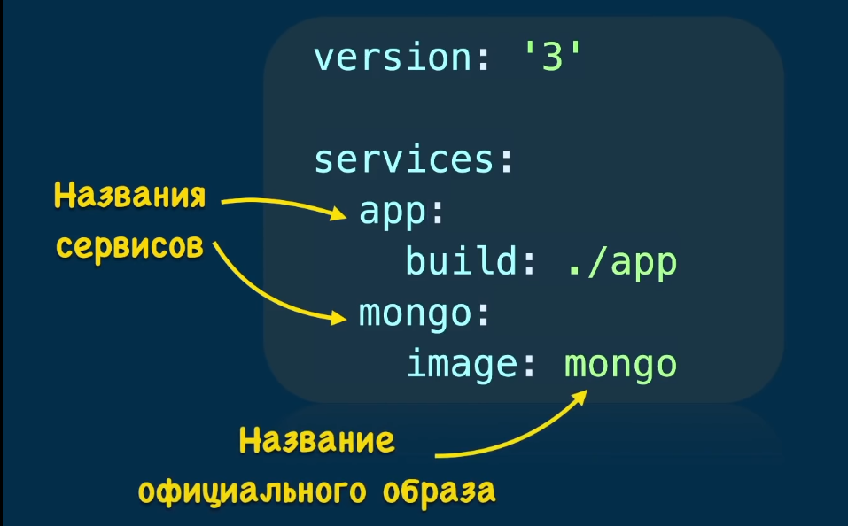

<table>
  <tr>
    <td colspan='2'>
      <h1>DOCKER COMPOSE</h1>
    </td>
  </tr>
  <tr>
  <td colspan="2">
      
    </td>
  </tr>
  <tr>
  <td colspan="2">
      Название сервиса определяем сами.  
      Инструкция уже включает создание образа приложения <code>app</code> 
      <code>./app</code> указываем место положение приложения. Предварительно создав там Dockerfile. 
    </td>
  </tr>
  <tr>
    <th><code>docker-compose stop</code></th>
    <td>Останавливает контейнераы <code>docker-compose stop [options] [SERVICE...]</code>  

    </td>
  </tr>
  <tr>
    <th><code>Docker-compose up</code></th>
    <td>Запуск создания контейнера. 
      <code>Формат Docker-compose up [options] [SERVICE...]</code>  
      <code>Формат Docker-compose up -d</code> 
      <code>Формат Docker-compose up -d --build</code>
    </td>
  </tr>
  <tr>
    <th><code>Docker-compose down</code></th>
    <td>Останавливает и удаляет контейнеры </td>
  </tr>
  <tr>
    <th><code>Docker logs < id-контейнера ></code></th>
    <td> Смотрим логи контейнера который имеет id < id-контейнера > или иего имя </td>
  </tr>
  <tr>
    <th><code>docker-compose top[SERVICE...]</code></th>
    <td>Проверьте процесс работы в каждом сервисном контейнере</td>
  </tr>
  <tr>
    <th><code>docker-compose pause [SERVICE...]</code></th>
    <td>Служба остановилась Пауза</td>
  </tr>
  <tr>
    <th><code>docker-compose logs[SERVICE...]</code></th>
    <td>Посмотреть журнал</td>
  </tr>
  <tr>
    <td colspan="2"><h2>Флаги</h2>
      <code>-f</code>, --Файл шаблона Compose, указанный файлом файла, Docker по умолчанию-compose.YML может быть указан несколько раз. 
      <code>-p</code>, --project-Имя имени указывает имя проекта и использует имя каталога в качестве имени проекта по умолчанию. 
      <code>--x-Сеть</code> использует характеристики Docker's Insertable Network -End.  
      <code>--x-network-Драйвер</code> драйвера указывает драйвер сетевого бэк -конца, по умолчанию  
      --ПРОВОДНЫЙ ВЫХОД БОЛЬШЕ ИНФОРМАЦИИ.  
      <code>--build</code> говорим docker-у заново пересоздать образы, каждый раз когда изменили приложение.  
      <code>-d</code> запуск создания в background.  
      <code>-v</code> - позволяет подключить том. 
      <code>--dns=[]</code>           : Установиkивает пользовательские dns-серверы для контейнера  
      <code>--network="bridge"</code> : Подключяет контейнер к сети  
      … … … <code>'bridge'</code>: Подключите контейнер к мосту через интерфейсы veth  
      … … … <code>'none'</code>:Нет сети в контейнере  
      … … … <code>'container:< name|id >'</code>:Используйте сетевой стек другого контейнера, указанный через его имя или идентификатор.  
      … … … <code>'host'</code>: Используйте сетевой стек хоста внутри контейнера.  
      <code>'< network-name >|< network-id >'</code>:подключение к определяемой пользователем сети  
      <code>--network-alias=[]</code> : Добавьте псевдоним в сетевой области для контейнера  
      <code>--add-host=""</code>      : Добавьте строку в <code>/etc/hosts (host:IP)</code>  
      <code>--mac-address=""</code>   : Задает MAC-адрес устройства Ethernet контейнера  
      <code>--ip=""</code>     : Задает IPv4-адрес устройства Ethernet контейнера  
      <code>--ip6=""</code>           : Задает IPv6-адрес устройства Ethernet контейнера  
      <code>--link-local-ip=[]</code> : Установите локальные адреса IPv4/IPv6 для соединения с одним или несколькими устройствами Ethernet контейнера
    </td>
  </tr>
  <tr>
    <td colspan="2">
      <code>Docker-compose [COMMAND] --help</code>  
      Или <code>докер-compose help [COMMAND]</code>  Вы можете просмотреть формат конкретной команды.
    </td>
  </tr>
  <tr>
    <td colspan="2">
      <a href="https://docs.docker.com/get-started/08_using_compose/" target="_blank">1. Documetation - Short sintaxis </a>  
      <a href="https://docs.docker.com/compose/compose-file/compose-file-v3/#long-syntax-1" target="_blank">2. Documetation - a long sintaxis </a> 
      <a href="https://docs.docker.com/compose/gettingstarted/" target="_blank">3. Documetation </a> 
      <a href="https://en.spec-zone.ru/docker~19-compose/" target="_blank">4. Documetation </a> 
    </td>
  </tr>
</table>

Файл docker-compose должен начинаться с тега версии.
Мы используем "3" так как это - самая свежая версия на момент написания этого кода.

<code> version: "3"</code>

Следует учитывать, что docker-composes работает с сервисами. 1 сервис = 1 контейнер. 
Сервисом может быть клиент, сервер, сервер баз данных... 
Раздел, в котором будут описаны сервисы, начинается с <code>services</code>.

<code>services</code>
  
Будут созданы клиентское и серверное приложения. 
  Это означает, что нам нужно два сервиса. 
  Первый сервис (контейнер): сервер. Назвать его можно так, как нужно разработчику. 
  Понятное название сервиса помогает определить его роль. 
  Здесь мы, для именования соответствующего сервиса, используем ключевое слово 'server'.

  <code>server</code>
    
Ключевое слово "build" позволяет задать  
    путь к файлу Dockerfile, который нужно использовать для создания образа, 
    который позволит запустить сервис. 
    Здесь 'server/' соответствует пути к папке сервера,  
    которая содержит соответствующий Dockerfile.

  <code>build: server/</code>
    
Команда, которую нужно запустить после создания образа.  
    Следующая команда означает запуск <code>python ./server.py</code>.

  <code>command: python ./server.py</code>
    
Вспомните о том, что в качестве порта в <code>server/server.py</code> указан <code> порт 1234</code>.   
    Если нужно обратиться к серверу со своего компьютера (находясь за пределами контейнера), 
    следует организовать перенаправление этого порта на порт компьютера. 
    Сделать это поможет ключевое слово <code>ports </code>. 
    При его использовании применяется следующая конструкция: <code>[порт компьютера]:[порт контейнера]</code> 
    В данном случае нужно использовать порт компьютера <code>1234</code> и организовать его связь с портом  
    <code>1234</code> контейнера (так как именно на этот порт сервер ожидает поступления запросов).

    <pre><code>ports:
      - 1234:1234</code></pre>

  ## Второй сервис (контейнер): клиент.
  
Этот сервис назван <code>client</code>.

  <code>client:</code>
    
Здесь <code>client/</code> соответствует пути к папке, которая содержит  
    файл Dockerfile для клиентской части системы.

  <code>build: client/</code>
    
Команда, которую нужно запустить после создания образа. 
    Следующая команда означает запуск <code>python ./client.py</code>.

  <code>command: python ./client.py</code>
    
Ключевое слово <code>network_mode</code> используется для описания типа сети.
    Тут указывается, что контейнер может обращаться к <code>localhost</code> компьютера.

  <code>network_mode: host</code>
    
Ключевое слово <code>pends_on</code> позволяет указывать, должен ли сервис, 
    прежде чем запуститься, ждать, когда будут готовы к работе другие сервисы. 
    Нужно, чтобы сервис <code>client</code> дождался бы готовности к работе сервиса <code>server</code>.

  <pre><code>depends_on:
    - server</code></pre>
